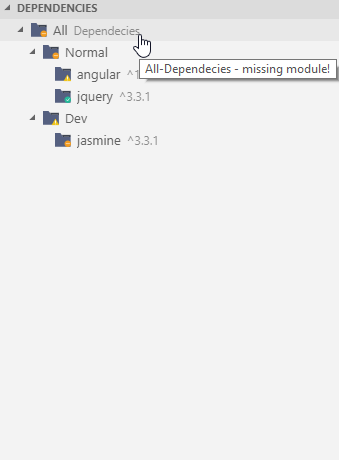

# VSCode npm-helper
A VS Code extension to check for npm package is exist and satisfied required version in package.json  

[](https://marketplace.visualstudio.com/items?itemName=karanba.npm-helper-commands) [](https://raw.githubusercontent.com/karanba/npm-helper/master/LICENSE) [](https://github.com/karanba/npm-helper) [](https://github.com/karanba/npm-helper/issues) 

## Overview

This extension show a tree view of your package list inside explorer.

## Installation

```
ext install karanba.npm-helper
```

# Prerequisites

You must hvae a package.json file under the root folder of your project.

 

# Features
Following commands are avalible in explorer/context, editor/context and editor/title/context menus.
 
* Open workbench 
* Annotate file 
* Show revision history
* Compare revisions side-bye-side

## Available Commands
* npm helper: Refresh

# Feedback & Contributing

 * Please report any bugs, suggestions or documentation requests via the [Github issues](https://github.com/karanba/npm-helper/issues).
 * Feel free to submit [pull requests](https://github.com/karanba/npm-helper/pulls).